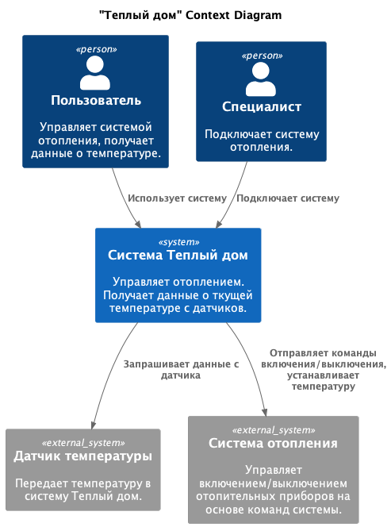
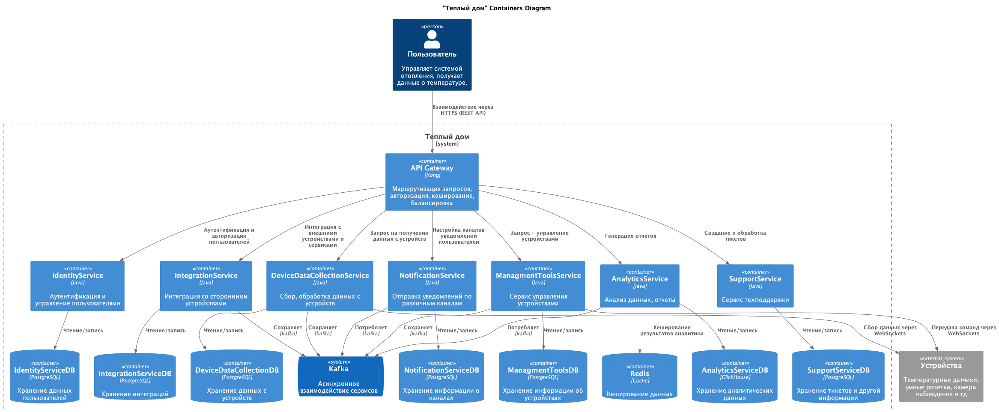
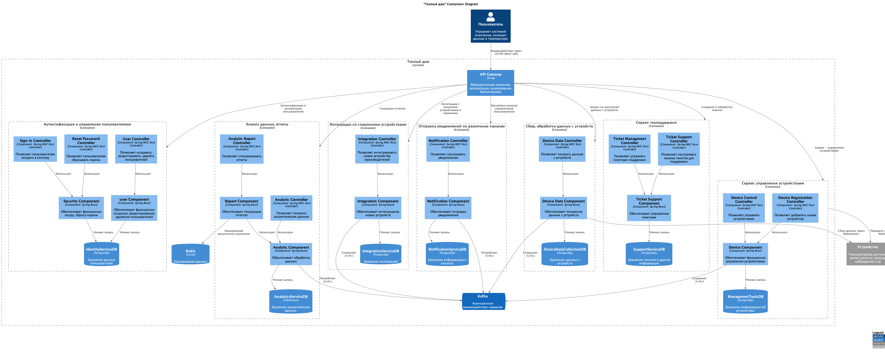
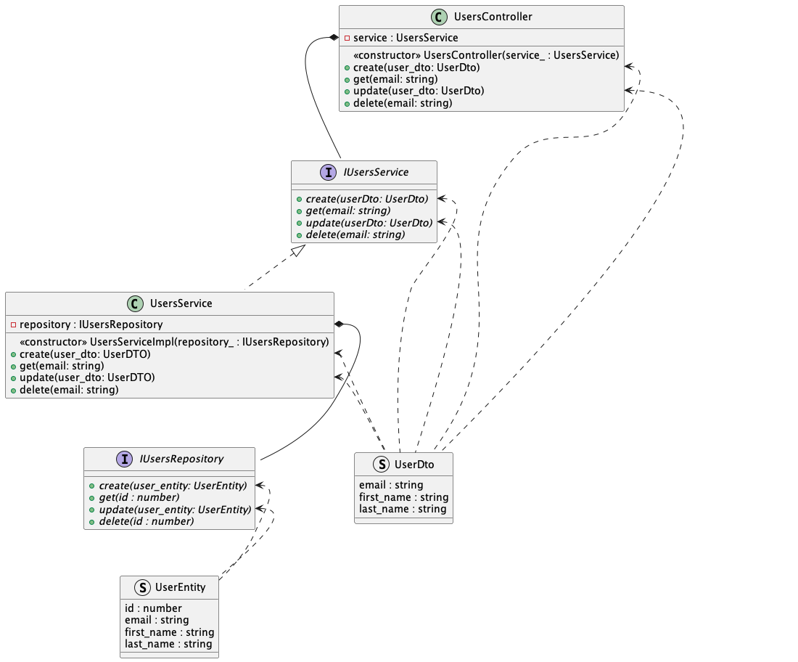
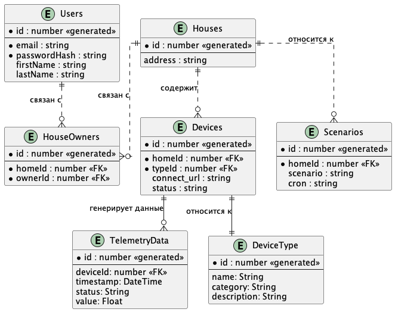

# Задание 1. Анализ и планирование

<aside>
</aside>

### 1. Описание функциональности монолитного приложения

**Управление отоплением:**

- Пользователи могут:
  - получать информацию о конкретной системе отопления в доме (id, состояние, текущую температуру, целевую температуру).
  - включить конкретную системе отопления в доме.
  - выключить конкретную системе отопления в доме.
  - установить целевую температуру в доме.

- Система поддерживает:
  - синхронное взаимодействие с датчиками.
  - управление состоянием системы отопления (включение/выключение).
  - управление целевой температурой системы отопления (устанавливать целевую температуру).
  - хранение данных о системе управления отоплением

**Мониторинг температуры:**

- Пользователи могут:
  - получать текущую температуру в доме.
  - получать целевую температуру в доме.

- Система поддерживает:
  - хранение данных с датчиков (температура)
  - получение данных о температуре с датчиков в доме

### 2. Анализ архитектуры монолитного приложения

- Язык программирования: Java.
- База данных: Postgres.
- Архитектура приложения: монолитная.
- Интерфейс: синхронный (HTTP). 
- Внутрення архитектура монолита: слоеная (слой интерфейса/бизнес логики/ доступа к данным). Взаимодействие между компонентами синхронное. Все компоненты монолита связаны между собой в едином модуле.
- Масштабируемость: ограничена, нет возможности масштабировать по частям.
- Развёртывание: Требует остановки всего приложения.

### 3. Определение доменов и границы контекстов

- Домен: управления системой отопления
  - поддомен управления устройствами в доме
    - контекст: велючение/выключение устройств
    - контекст: управление функционалом устройств
  - поддомен установки устройств в доме
    - контекст: подключения новых устройств
    - контекст: контроль связи с устройством

- Домен: мониторинга температуры
  - поддомен сбора данных с датчиков температуры
    - контекст: получение данных с датчиков температуры
    - контекст: хранение данных с датчиков температуры

### **4. Проблемы монолитного решения**

- Развертывание и обновление - тк приложение монолитное, то изменения требуют перезапуска всего приложения, при изменении одной части необходимо тестировать все приложение целиком
- Масштабируемость - нет возможности ма масштабировать отдельные части системы
- Высокий риск ошибки - изменения в одной части могут повлиять на другую, сильная связаность компонентов системы
- Время разработки - трудность управления командой, высокие риски, увелечения времени на развертывание и обноление, в целом увеличивают время разработки
- Тестирование - тк все компоненты связыны, то приходится тестировать все вместе

### 5. Визуализация контекста системы — диаграмма С4

### [C4 Диаграмма монолита](./C4_diagrams/task_1/SystemContext.puml)

# Задание 2. Проектирование микросервисной архитектуры

**Диаграмма контейнеров (Containers)**

### [C4 Диаграмма контейнеров](./C4_diagrams/task_2/ContainersDiagram.puml)

**Диаграмма компонентов (Components)**

### [C4 Диаграмма компонентов](./C4_diagrams/task_2/ComponentsDiagram.puml)

**Диаграмма кода (Code)**

### [C4 Диаграмма кода](./C4_diagrams/task_2/CodeDiagram.puml)

# Задание 3. Разработка ER-диаграммы

### [ER-диаграмма](./C4_diagrams/task_3/ErDiagram.puml)

# ❌ Задание 4. Создание и документирование API

### 1. Тип API

Укажите, какой тип API вы будете использовать для взаимодействия микросервисов. Объясните своё решение.

### 2. Документация API

Здесь приложите ссылки на документацию API для микросервисов, которые вы спроектировали в первой части проектной работы. Для документирования используйте Swagger/OpenAPI или AsyncAPI.